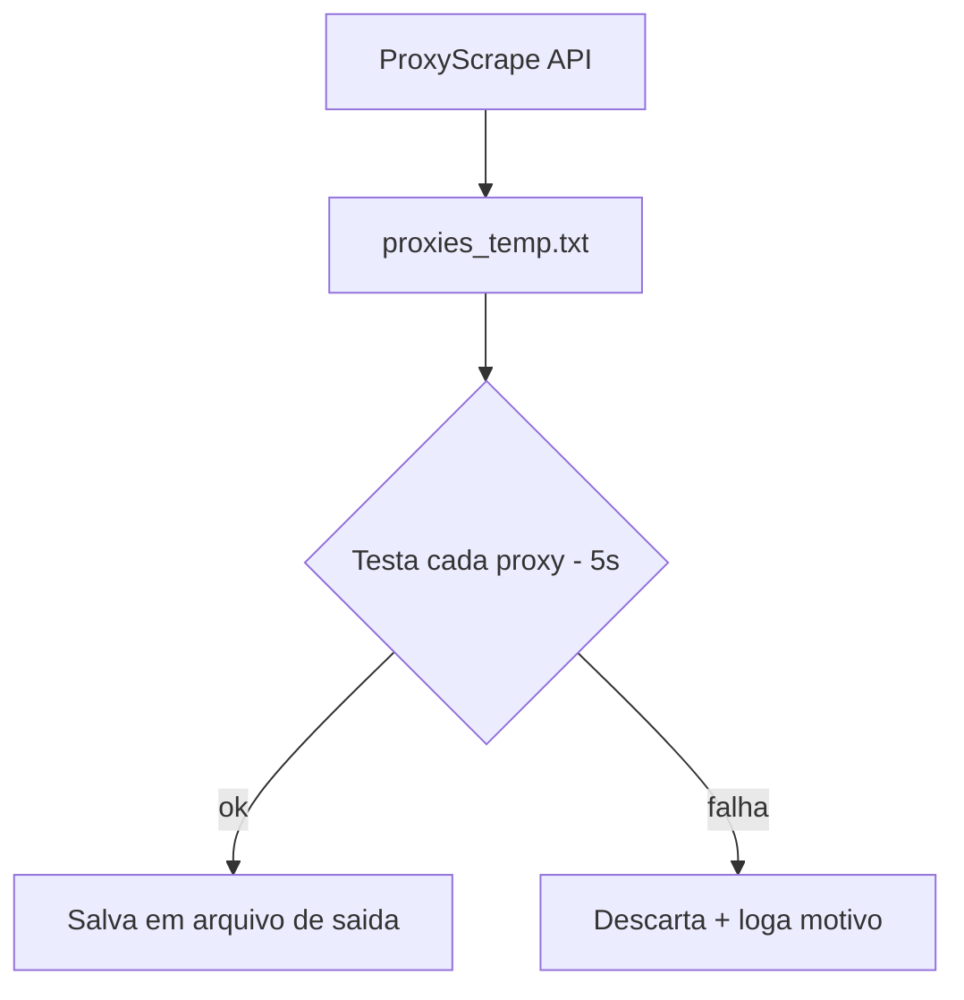

# 🌐 HTTP Proxy Analyst
<p align="center">
  
  <a href="https://github.com/panda12332145/http-proxy-analyst/commits/main"></a>
  <a href="https://github.com/panda12332145/http-proxy-analyst"></a>
  
</p>
---
## 🔖 Resumo

Utilitário Python que **baixa uma lista pública de proxies** da internet, **testa** cada um fazendo requisição a um site de referência e **salva em arquivo** apenas os que estão funcionando — automatizando a curadoria de proxies para scraping, anonimização de tráfego ou contornar restrições de rede.

### ✨ Funcionalidades Principais

- ✅ Download automático de lista de proxies (ProxyScrape API)
- ✅ Teste individual com timeout de 5s por proxy
- ✅ Relatório no terminal (Funcionando / Falha + motivo)
- ✅ Salva somente os proxies válidos em arquivo de saída

## 📽 Demonstração

```text
$ python "http proxy analyst.py"
Lista de proxies baixada e salva em proxies_temp.txt
Proxy: 1.2.3.4:8080 - Status: Funcionando
Proxy: 5.6.7.8:3128 - Status: Falha (ConnectTimeout: ...)
Proxys funcionando foram salvos em saida.txt
```

## ⚙️ Explicação das Partes Importantes

### Download da lista

```python
def download_proxies(api_url, output_file):
    response = requests.get(api_url)
    response.raise_for_status()
    with open(output_file, 'w') as file:
        file.write(response.text)
```

> Consome a API pública ProxyScrape e grava os candidatos em `proxies_temp.txt`.

### Teste de cada proxy

```python
def verificar_proxy(proxy):
    response = requests.get("https://www.example.com",
        proxies={"http": proxy, "https": proxy}, timeout=5)
    return "Funcionando" ...
```

> Métrica simples: se a requisição passar pelo proxy dentro do timeout, ele é considerado saudável.

### Filtragem e saída

```python
def salvar_proxys_funcionando(arquivo_saida, proxys_funcionando):
    file.write("\n".join(proxys_funcionando))
```

> Só os 'Funcionando' vão para o arquivo final — pronto para usar em outras ferramentas.

## 🔄 Fluxo de Trabalho / Arquitetura



## 📂 Estrutura do Projeto

```plaintext
http-proxy-analyst/
├── http proxy analyst.py   # Script principal
├── README.md
├── Screenshot_*.jpg        # Prints da execução
└── (proxies_temp.txt, saida.txt — gerados)
```

## 🛠️ Tecnologias

| Ferramenta | Uso |
|---|---|
| **Python 3** | Linguagem |
| **requests** | HTTP + proxies |
| **ProxyScrape API** | Fonte da lista de proxies |

## ▶️ Instalação

```bash
git clone https://github.com/panda12332145/http-proxy-analyst.git
cd http-proxy-analyst
pip install requests
```

## 🚀 Execução

```bash
python "http proxy analyst.py"
# digite o nome do arquivo de saída quando solicitado
```

## ⚠️ Limitações

- Depende de listas públicas (qualidade variável)
- Teste só verifica conectividade (não anonimidade)
- Sem concorrência — testa um a um

## 🚀 Roadmap

- [ ] Teste em paralelo (ThreadPool)
- [ ] Verificar país/latência do proxy
- [ ] Detecção de IP de saída real

## 📄 Licença

Todos os direitos reservados ao autor.

---

## 👾 Autor

<p align="center">
  
</p>

<p align="center">Feito por <strong>Panda12332145</strong> 👋🏽</p>

---

## 🧑‍💻 Sobre Mim

Sou apaixonado por **Física Teórica, Cibersegurança e Desenvolvimento de Sistemas**. Tenho grande interesse em programação de baixo nível, engenharia reversa, automação, sistemas Windows, criptografia e segurança ofensiva. Também gosto bastante de música, filosofia e computação avançada.

---

## 🌐 Redes

* **Site:** [https://panda-h0me.netlify.app/](https://panda-h0me.netlify.app/)
* **YouTube:** [https://www.youtube.com/@X86BinaryGhost](https://www.youtube.com/@X86BinaryGhost)
* **Instagram:** [https://www.instagram.com/01pandal10/](https://www.instagram.com/01pandal10/)
* **GitHub:** [https://github.com/panda12332145](https://github.com/panda12332145)
* **LinkedIn:** [linkedin.com/in/athos-da-boanergis](https://www.linkedin.com/in/athos-d%C3%A3-boanergis-5585a4288/)

---

## 🚀 Áreas de Interesse

* **Cibersegurança Avançada** 🔒
* **Hacking & Engenharia Reversa** 💻
* **Computação de Baixo Nível** 🖥️
* **Matemática e Física Teórica** 📐⚛️
* **Desenvolvimento de Ferramentas de Segurança** 🛠️

_"Conhecimento é poder, e domínio técnico vem da compreensão profunda dos sistemas."_

---

## 📞 Contato & Suporte

Para colaborações, dúvidas ou sugestões:

📧 **E-mail:** [athos.cybersec@gmail.com](mailto:athos.cybersec@gmail.com)

🐛 **Reportar Bug:** [Abrir Issue](https://github.com/panda12332145/http-proxy-analyst/issues)

💡 **Sugerir Melhoria:** [Discussions](https://github.com/panda12332145/http-proxy-analyst/discussions)
